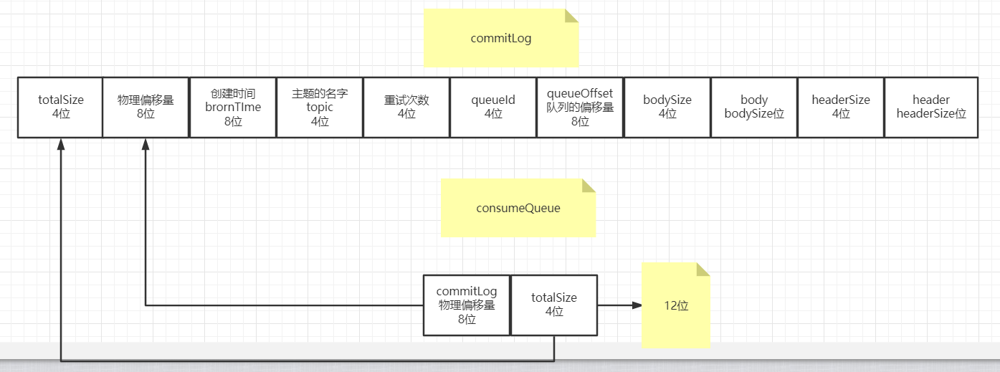

###Bankrupt MQ
一个基于rocketmq自己的实现简易破产版MQ

部分图片地址
https://www.processon.com/diagraming/5f4c550af346fb2e295ca51a

###通信模块netty,已经弄成单独包(已完成)
remote
- server(已完成)
- client(已完成)

~序列化方式暂时只支持JSON,到时候写完扩展

消息格式如图

###broker
- 1 start (已完成)
- 2 topic 创建(已完成) 同步(已完成) 删除(还没写)
- 3 commitLog 已完成(暂时是单个文件)
- 4 queue 已完成

###producer
生产者(已完成)

延迟消息(已完成，可在配置里面修改延迟级别)

###consumer
消费者(已完成) 实现的不是很好，只有改进